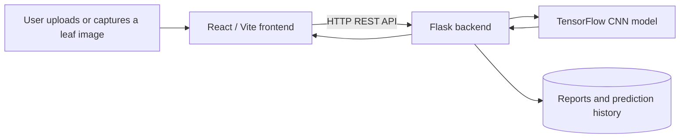

# Plant Disease Detection System (IoT + AI)

## Overview
This project is an AI-powered web application that detects plant diseases from leaf images using a Convolutional Neural Network (CNN).

## Architecture



## Features
- Upload image or use camera
- Disease prediction with confidence score
- Severity analysis
- Healthy reference comparison
- Dashboard with model metrics
- PDF report generation

## Sample prediction

The application returns a prediction similar to the example below. Values are
illustrative; the actual result depends on the uploaded image and model output.

| Field | Example result |
| --- | --- |
| Plant | Tomato |
| Detected condition | Late blight |
| Confidence | 93.8% |
| Severity | High |
| Suggested next step | Remove affected leaves and monitor the plant closely |

## Limitations

- The classifier currently supports the plant categories used by the
  PlantVillage-based model: Apple, Blueberry, Cherry, Corn, Grape, Orange,
  Peach, Pepper Bell, Potato, Raspberry, Soybean, Squash, Strawberry, and
  Tomato.
- For the best results, upload a clear, well-lit image with the leaf visible
  and reasonably centered. Blurry images, heavy shadows, multiple leaves, or
  complex backgrounds can reduce confidence.
- Predictions are intended for educational and early-screening purposes, not
  as a substitute for professional agricultural diagnosis.
- This is a senior design/student project and has not been validated as a
  production-grade agricultural diagnostic tool.

## Technologies Used
- Python (Flask)
- TensorFlow (CNN Model)
- React (Frontend)
- Scikit-learn, NumPy, PIL

## How to run

Use [the environment guide](../docs/ENVIRONMENT_SETUP.md) for the native
Windows GPU environment and training commands.

### Backend environment (Windows)

For the supported native-Windows GPU setup, the backend uses the Conda
environment at `leafai/backend/.venv`. From the repository root, create it
once, activate it, and install the backend requirements:

```powershell
Set-Location leafai/backend

# Create the environment once (requires Conda on PATH)
conda create --prefix "$PWD\.venv" python=3.10 cudatoolkit=11.2 cudnn=8.1.0 -y

# Activate the environment for this terminal
conda activate "$PWD\.venv"

# Install or update the backend dependencies
python -m pip install --upgrade pip
python -m pip install -r requirements.txt
python -m pip check
```

If the existing `.venv` is a regular Python virtual environment rather than a
Conda environment, activate it with the following commands instead:

```powershell
Set-Location leafai/backend
.\.venv\Scripts\Activate.ps1
python -m pip install --upgrade pip
python -m pip install -r requirements.txt
python -m pip check
```

TensorFlow 2.10.1 is required for native Windows NVIDIA GPU support; do not
upgrade it to 2.11 or later. For GPU training, use the Conda setup described
in [the environment guide](../docs/ENVIRONMENT_SETUP.md).

### Backend (Windows)

```powershell
Set-Location leafai/backend
.\run_backend.ps1
```

The API runs at `http://localhost:4000`.

### Optional chatbot provider (Groq)

The chatbot uses LeafAI's local plant library and can use Groq for hosted
answers. Copy `leafai/backend/.env.example` to `leafai/backend/.env`, then set
`GROQ_API_KEY` on the backend. The key stays on the server. `GROQ_MODEL` is
optional and defaults to `openai/gpt-oss-120b`; set it to a model available to
your Groq account when you want to use another one. Restart the backend after
changing environment values. Without a working Groq configuration, the chatbot
answers from the local library and saved scan summaries.

### CNN training (Windows GPU)

From PowerShell, run `.\train_windows_gpu.ps1` in `leafai/backend`. It performs
the GPU preflight first and then invokes the unchanged `train_cnn.py`. Use
`.\train_windows_gpu.ps1 -Preflight` to check CUDA without training.

### Frontend

```powershell
Set-Location frontend
npm install
npm run dev
```

The Vite client runs at `http://localhost:5173`.

## Contributors

- Sara
- Abdlrahman 
- Enad 
- Haya 
- Heyam 
- Shamma 

## License

LeafAI is released under the [MIT License](../LICENSE).
